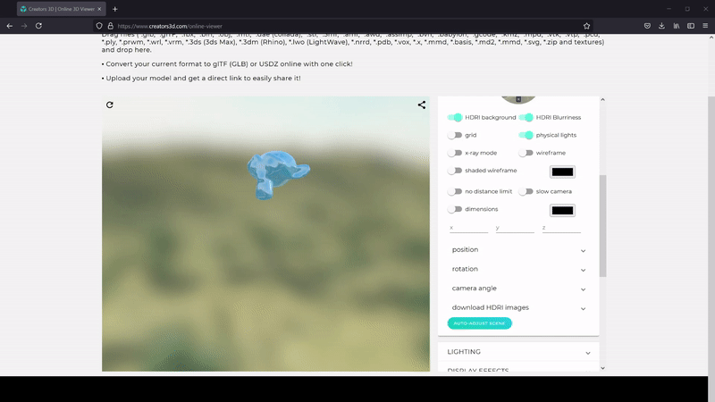
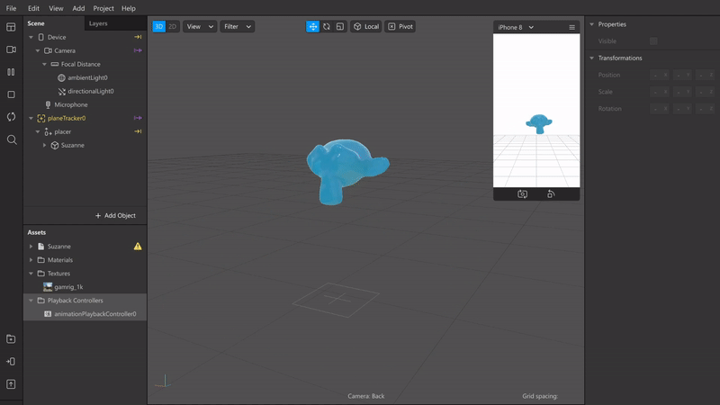

# AnimationConverter

This is Maya script for converting the frame by frame geometry animation(Such as simulated fluid, animated photogrammetry model)to the scale based animation.  
Optimize the frame rate 15 fps for web or mobile usage. Also this script will rearragne the UV layout.  
So that meshes can share textures and materials over the frames, which helps to reduce the number of drawcalls.

Originally this script designed for SparkAR studio usage.  
however the result FBX animation can be used any engines that uses FBX file.  
  
  

Prerequisite  
--Python2.7
--pillow  
  
Install and Usage.  
Import mesh sequence into Maya.
Download and place combineTexture.py to the folder that includes texture files for obj sequence.
Download the Animation converter.py, open that with script editor in Maya, and run the script. The UI window will show up.  
Put the path for python (eg.C:/usr/bin/python) and path for combineTexture.py(eg. C:/Users/admin/Desktop/tes/combineTexture.py).  
Hit the Convert Mesh Animation button.   
When it's done, you can save meshes as FBX. Optimized new textures are in "Combined" folder in your original folder.  
  

Current Limitation  July 2021
Mesh name format should be "mesh-f#####.obj"  
Framerate is fixed as 15fps  

Animation is playing on the web site
  
  
  
  
  
Animation is playing in SparkAR  
 
